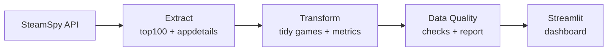

# 🎮 Steam Games Insights

An end-to-end, AI-assisted data product that extracts data on the most-played
Steam games from a **free, keyless public API**, runs an ETL + data-quality
pipeline, and presents business-facing insights in an interactive **Streamlit**
dashboard.

Built for the *AI Data Engineer — End-to-End Home Assignment*.

---

## 1. Project overview & selected API

**Product:** A games-market analytics dashboard covering the most-played Steam
titles. It answers practical questions a games publisher / market analyst asks:

- *What is being played right now (live concurrent players)?*
- *Which games have the best reception vs. their audience size?*
- *How are titles priced, and what is on sale?*
- *Which genres dominate players, ownership and ratings?*

**API:** [SteamSpy](https://steamspy.com/api.php) — chosen because it is:

- **Free and keyless** — no signup, no API key, no secrets to configure.
- **Reproducible for a reviewer** — runs with zero manual data preparation.
- Rich enough for real analytics: reviews, owners, concurrent users, price,
  discount, playtime, and (via per-app details) genre and tags.

Two request types are used:

| Purpose | Request |
| --- | --- |
| Base top-games list (popularity, reviews, CCU, owners, price) | `?request=top100in2weeks` |
| Per-game enrichment (genre, tags, languages) | `?request=appdetails&appid=<id>` |

---

## 2. How to run locally

```bash
git clone <repository-url>
cd steam-games-insights
python -m venv .venv

# Windows:
.venv\Scripts\activate
# macOS/Linux:
source .venv/bin/activate

pip install -r requirements.txt
python etl.py
streamlit run app.py
```

> **No API key required.** SteamSpy is keyless. The ETL first pulls the top-100
> list, then enriches the top **50** games with genre/tags. To respect
> SteamSpy's polite rate limit (~1 request/second), enrichment is throttled, so
> `python etl.py` takes **roughly a minute**. You can lower `TOP_N_ENRICH` in
> [`src/config.py`](src/config.py) for a faster run.

After the ETL completes, the dashboard reads local files and works offline.

---

## 3. Repository structure

```
steam-games-insights/
├── README.md
├── requirements.txt
├── app.py                     # Streamlit application (dashboard)
├── etl.py                     # ETL entry point (extract → transform → quality)
├── src/
│   ├── config.py              # Endpoints, enrichment size, thresholds, paths
│   ├── extract.py             # SteamSpy calls, retries, enrichment, raw persistence
│   ├── transform.py           # Cleaning, parsing, metrics, aggregation
│   ├── quality.py             # Data-quality checks + report
│   └── utils.py               # Logging, JSON I/O
├── tests/
│   └── test_etl.py            # Offline unit tests (pytest)
├── data/
│   ├── raw/                   # Raw API extracts (JSON)
│   └── processed/             # games.csv, genre_summary.csv, quality report
└── ai_transcript/
    └── transcript.md          # Full AI conversation transcript
```

---

## 4. Data model & ETL explanation

The pipeline has three clear stages (see `etl.py`):

### Extract — `src/extract.py`
- Pulls the `top100in2weeks` base list in a single call.
- Enriches the top `TOP_N_ENRICH` games with per-app `appdetails` (genre, tags,
  languages), throttled to ~1 req/sec.
- **Resilience:** each request is retried with backoff on timeouts / HTTP
  errors; a failing enrichment call keeps the base fields rather than dropping
  the game. Raw JSON is saved to `data/raw/` for full reproducibility.

### Transform — `src/transform.py`
Produces two tidy analytical tables:

**`games.csv`** — one row per game:

| Column | Meaning |
| --- | --- |
| `appid`, `name`, `developer`, `publisher` | Identity |
| `positive`, `negative`, `total_reviews` | Review counts |
| `review_ratio` | Derived: `positive / total × 100` (%) |
| `ccu` | Live concurrent players |
| `owners_min`, `owners_max`, `owners_mid` | Parsed owners estimate bucket |
| `price_usd`, `initial_price_usd`, `discount_pct` | Pricing (cents → USD) |
| `avg_playtime_hours`, `median_playtime_hours` | Playtime (minutes → hours) |
| `primary_genre`, `all_genres`, `top_tags` | Segmentation |
| `is_free`, `on_sale`, `rating_label` | Derived flags/labels |

**`genre_summary.csv`** — one row per primary genre (game count, avg review
ratio, total CCU, avg price, total owners, free-game count).

Key transformations: parsing the `"1,000,000 .. 2,000,000"` owners bucket into
numbers, converting price cents → USD and playtime minutes → hours, deriving a
`review_ratio`, and bucketing reception into a `rating_label` (Positive / Mixed /
Negative / Insufficient data) that respects a minimum review volume.

### Data quality — `src/quality.py`
Runs explicit checks and writes `data/processed/data_quality_report.json`.



---

## 5. Dashboard / application overview

`app.py` is a **Power BI-style, Steam-themed** dashboard (a blue/purple gradient
matching Steam's "Dark Blue & Purple" profile theme). It has a left **"Pages"
navigation** and, on the analytical pages, **compact dropdown filters** (Title /
Publisher / Country / Date) so a single title list never floods the screen.

- **🧠 Summary** — an **agentic** page: headline KPIs plus an "AI-generated
  insights" panel that is computed from the data on every run (trend direction,
  weekend seasonality, top title/market, best-received genre, free-vs-paid mix),
  with a players-by-date trend and a players-by-market donut.
- **🌐 Usage Worldwide** — an executive growth page with **MAU, DAU and new-user**
  KPI cards that show **increment/decrement vs. the same month last year**
  (green ▲ / red ▼), plus MAU-by-month, DAU-by-month, new-users-by-month,
  net-MAU-change month-over-month, hours-by-month and **year-over-year sessions**
  charts (with a Year dropdown).
- **📈 Title Usage Overview** — usage (player-hours) of each title **by date** as
  a multi-series line graph, plus total usage by title and usage share by country.
- **📋 Title Usage by Metric** — a Power BI-style **table** (TitleName /
  TotalHours / TotalSessions / UniqueUsers) with a Genre selector and the
  dropdown filters, plus **Top 5 titles** bar charts by sessions, play hours and
  unique users.
- **👥 Active Players** — number of users playing each title **by date** (line),
  players by country (bar), and a stacked daily-players-by-country chart.
- **🎯 Genre Distribution** — games and live players per genre, and players by
  genre over time.
- **📊 Market Snapshot** — reception vs. audience size, price distribution and
  top games (with genre / price / publisher dropdowns).
- **✅ Data Quality** — the full quality report with an overall pass/fail badge.
- **🗂️ Data** — the processed snapshot and modeled usage tables, with CSV export.

The theme is set via [`.streamlit/config.toml`](.streamlit/config.toml) plus
custom CSS, and all charts use a shared blue/purple palette and dark template.

---

## 6. Data quality checks & validation logic

Implemented in `src/quality.py` and surfaced in the dashboard:

1. **Non-empty dataset** — the pipeline produced rows.
2. **Game coverage** — expected number of games present.
3. **No duplicate appids**.
4. **Names present** — no missing game names.
5. **Reviews non-negative** — positive/negative counts ≥ 0.
6. **Review ratio in range** — within `0–100`.
7. **Price valid** — non-negative and within a sane upper bound.
8. **Discount in range** — within `0–100%`.
9. **Logical relationship** — `owners_min ≤ owners_max`.

Additional handling: request retries/backoff, enrichment-failure isolation,
robust parsing of string numbers, and safe fallbacks for missing fields.

---

## 7. Assumptions & known limitations

- **Estimates, not exact figures** — SteamSpy owners are modelled *ranges*; we
  use the mid-point for ranking.
- **Daily & country data are modeled** — SteamSpy has no per-day or per-country
  data, so `usage_daily.csv` is a **deterministic estimate** derived from the
  snapshot (CCU, playtime, publisher) across a date window and a fixed country
  mix. It is reproducible and clearly labeled, but it is *not* measured data.
- **Monthly growth metrics are modeled** — `monthly_metrics.csv` (MAU, DAU,
  new users, sessions, hours across ~30 months) is likewise a deterministic,
  seeded estimate built from the snapshot totals with a growth trend and
  seasonality, powering the "Usage Worldwide" page. It is *not* measured history.
- **Snapshot in time** — CCU, prices and discounts change; re-running the ETL
  refreshes them.
- **Enrichment is capped** — only the top `TOP_N_ENRICH` games get genre/tags to
  keep the run fast and rate-limit-friendly.
- **Playtime can be zero** — SteamSpy does not report playtime for every title.
- **Single provider** — no cross-source reconciliation; if SteamSpy is
  unavailable the ETL retries then reports the failure.
- **Local storage only** — CSV/JSON files, no database (kept intentionally
  simple and reviewer-friendly).

---

## 8. How AI was used during the assignment

An AI assistant was used throughout — the full transcript is in
[`ai_transcript/transcript.md`](ai_transcript/transcript.md). In summary, AI helped to:

- Pick a **keyless** Steam data source (SteamSpy) and confirm its field shapes.
- Design the two-step extract (base list + throttled enrichment) and the data
  model (tidy games table + genre summary).
- Implement robust parsing (owners buckets, cents→USD, minutes→hours) and a
  meaningful set of quality checks.
- Design the dashboard's product narrative (popularity → reception → pricing →
  genres) and add offline unit tests.

AI output was reviewed and refined — e.g. capping enrichment for a fast run,
respecting the API rate limit, and isolating enrichment failures.

---

## 9. What I would improve with more time

- Enrich more games (or all top-100) via a cached, incremental refresh.
- Persist to a lightweight local database (SQLite/DuckDB) with a schema.
- Add trend tracking (store snapshots over time to show rising/falling games).
- Add tag-level analytics and a "similar games" view.
- Mock the SteamSpy HTTP layer in tests and add CI.

---

## Testing

```bash
pip install pytest
pytest -q
```

The tests run **fully offline** using synthetic data (no network calls).

---

*Data source: [SteamSpy](https://steamspy.com). Please do not include any
confidential or proprietary data when extending this project.*
